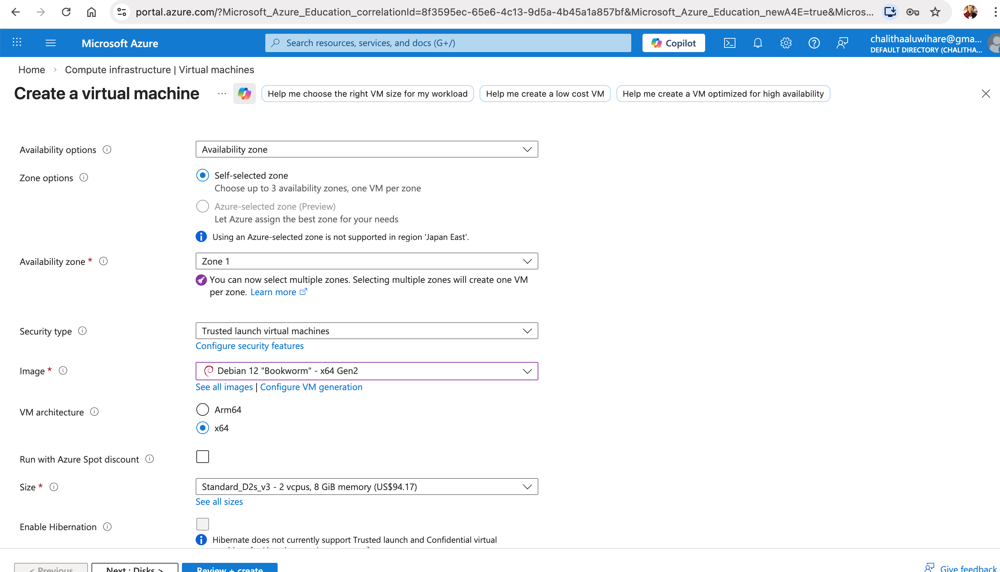
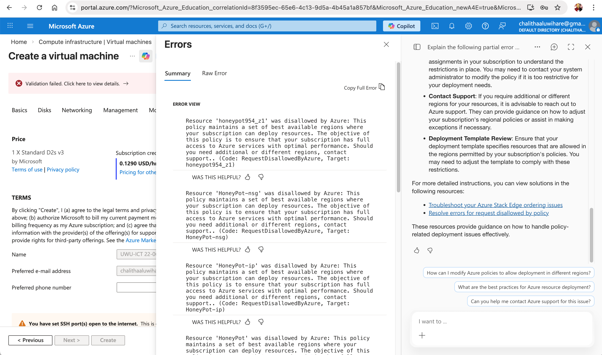
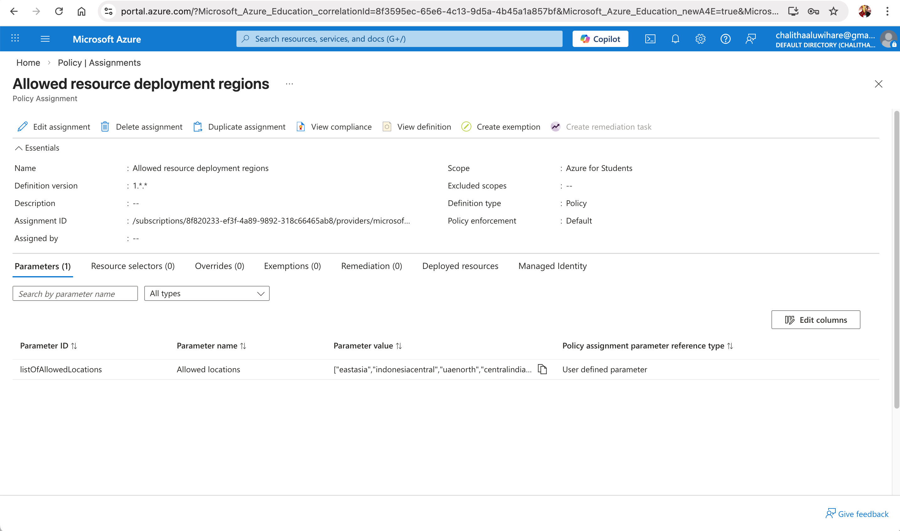
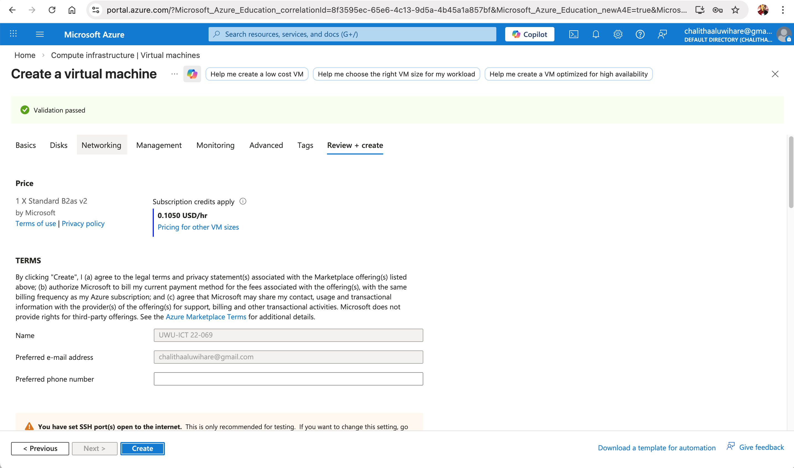
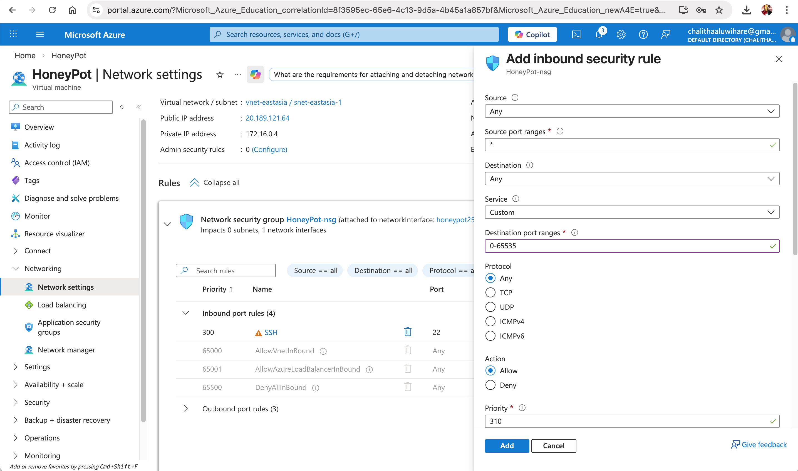
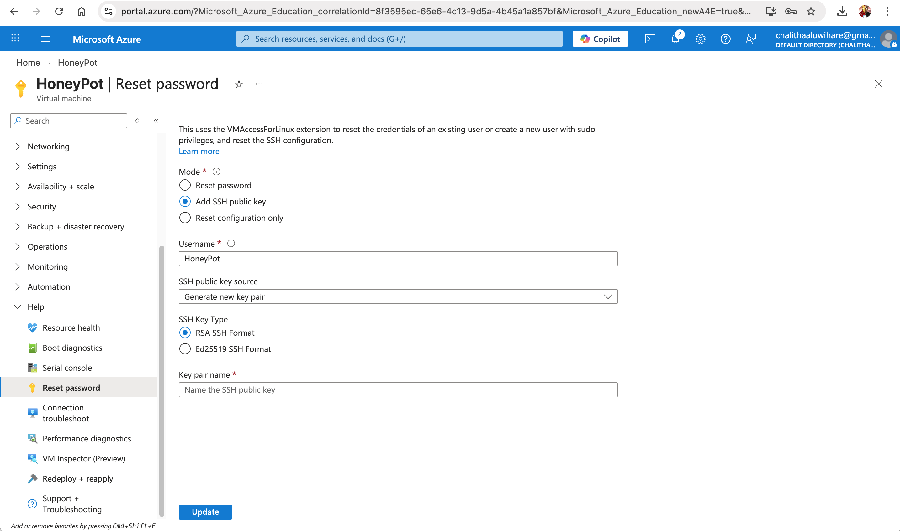
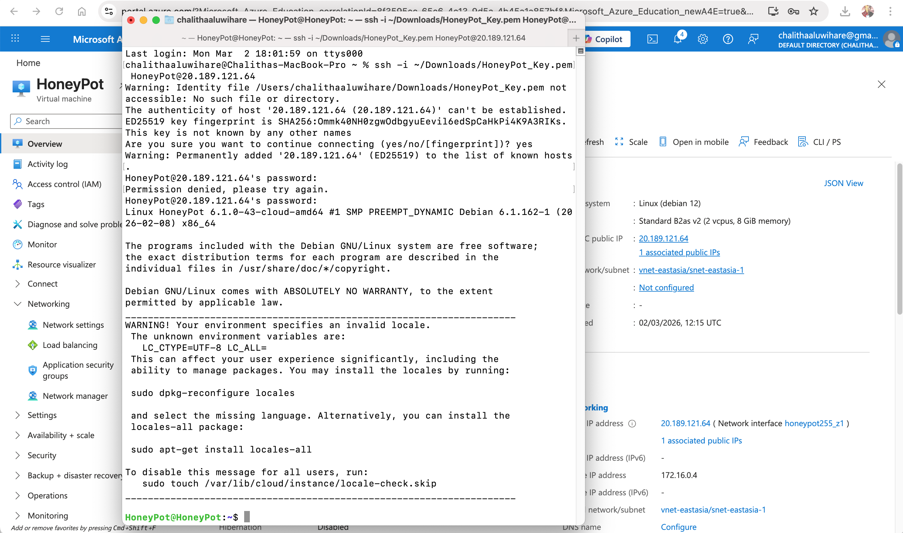
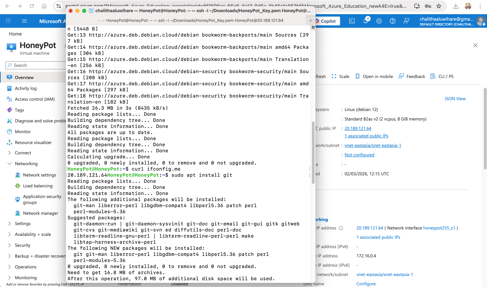

#  Stage 01 – Azure Infrastructure Setup

##  Objective

Deploy a publicly accessible Linux VM in Microsoft Azure for honeypot research.

---

##  Virtual Machine Creation

- Debian 12 (Bookworm) selected
- x64 Gen2 architecture
- Trusted Launch enabled
- Availability Zone configured


---

##  Azure Policy Issue

During deployment, VM creation failed due to:



Policy: Allowed resource deployment regions

Resolution:
- Navigated to Azure Policy → Assignments
- Verified allowed regions
- Selected approved region
- Deployment succeeded




---

##  Network Configuration

- Virtual Network created
- Public IP assigned
- Network Security Group (NSG) created
- Inbound rule added (0–65535 open)

Ports intentionally exposed for honeypot research


---

## SSH Configuration

- SSH key pair generated
- VM credentials reset
- Connected using:



```
ssh -i HoneyPot_Key.pem HoneyPot@<Public-IP>
```




```
ssh -i sudo apt update &&  sudo apt upgrade -y
```

