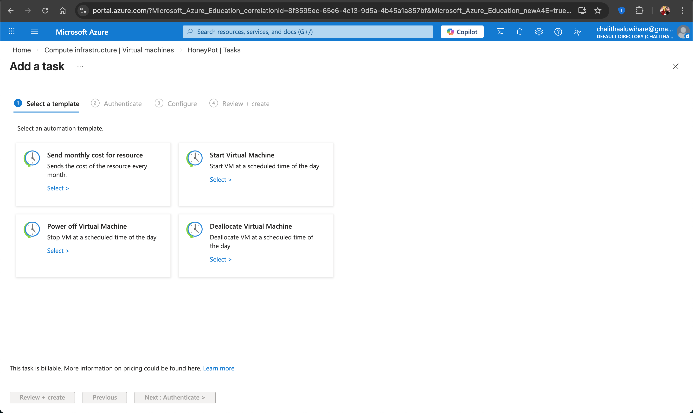
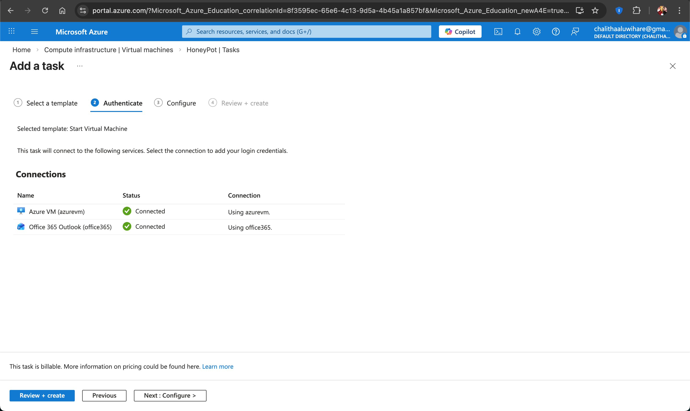
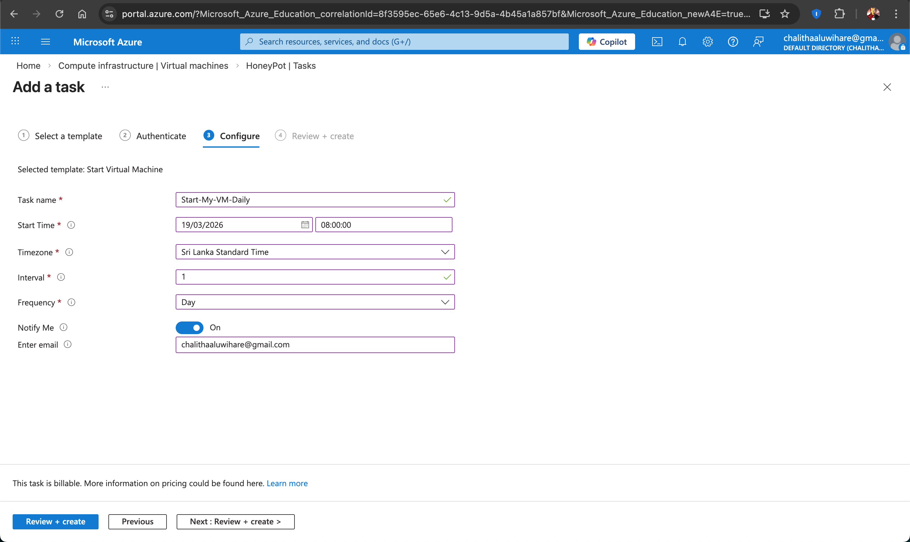
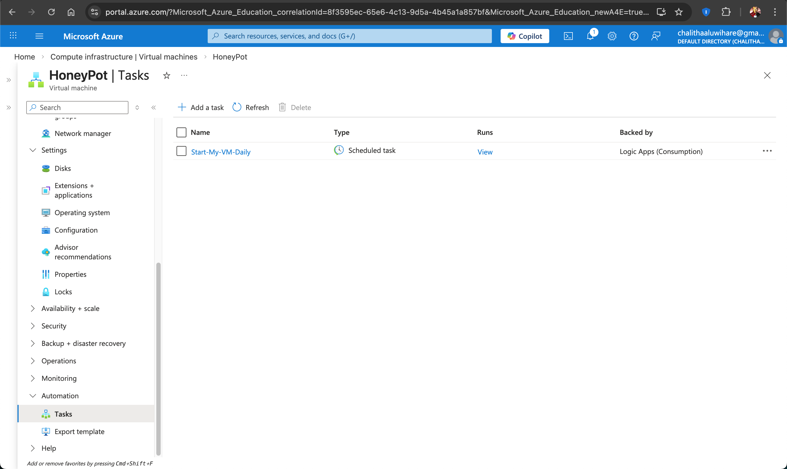

#  Azure VM Auto Start (Scheduled Task)

This guide explains how to create a scheduled task in Microsoft Azure to automatically start a Virtual Machine (VM) daily.

---

##  Step 1: Go to Virtual Machine

- Open **Azure Portal**
- Navigate to In the left panel

---

##  Step 2: Add a New Task

- Click on **+ Add a task**

---

##  Step 3: Select Template

Choose:

-  **Start Virtual Machine**

This option allows your VM to automatically start at a scheduled time.

### Screenshot

---

##  Step 4: Authenticate Connections

You need to connect required services:

- Azure VM → Connected  
- Office 365 Outlook →  Connected (for notifications)

If not connected:
- Click **Create**
- Sign in and authorize

### Screenshot

---

##  Step 5: Configure Task

Fill the following details:

- **Task Name**: `Start-My-VM-Daily`
- **Start Time**: `08:00 AM`
- **Timezone**: `Sri Lanka Standard Time`
- **Interval**: `1`
- **Frequency**: `Day`
- **Notify Me**: ON
- **Email**: your email address

### Screenshot

---

##  Step 6: Review & Create

- Click **Review + Create**
- Then click **Create**

---

##  Step 7: Verify Task

After creation, you will see:

- Task Name: `Start-My-VM-Daily`
- Type: Scheduled Task
- Status: Active

### Screenshot

---

##  Final Outcome

Your Azure VM will now:

- 🔄 Automatically start every day
- ⏰ At your scheduled time (8:00 AM)
- 📧 Send notifications (optional)

---

##  Notes

- This feature uses **Logic Apps (Consumption)** → may incur small cost
- Make sure your subscription is active
- VM must not be deleted or renamed

---

##  Tip

You can also create:
- Auto **Stop VM**
- Auto **Deallocate VM**

to save cost 

---
